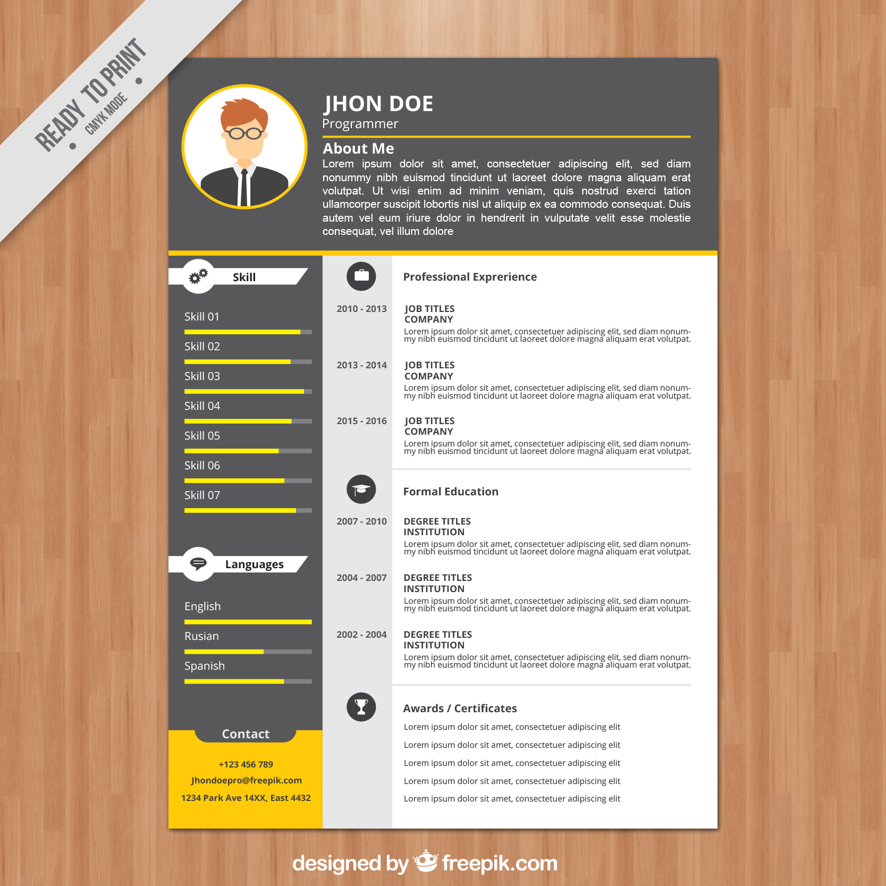

# Desenvolvendo Sites Responsivos com Bootstrap 4

> * [0. Pré-requisitos para o Minicurso:](#0-pré-requisitos-para-o-minicurso)
> * [1. Estrutura do HTML](#1-estrutura-do-html)
> * [2. Criar váriaveis no CSS:](#2-criar-váriaveis-no-css)
> * [3. Construção do Cabeçalho](#3-construção-do-cabeçalho)
> * [4. Sidebar (Coluna Lateral)](#4-sidebar-coluna-lateral)
> * [5. Central Bar (Barra Central)](#5-central-bar-barra-central)
> * [6. Conteúdo](#6-conteúdo)
> * [7. Hospedando no Github Pages](#7-hospedando-no-github-pages)

### Objetivo

Desenvolvimento de Currículum Online para o participante, no formato de Site Responsivo, utilizando o Bootstrap como framework front-end e hospedá-lo no [Github Pages](https://pages.github.com/).

Página de Exemplo: (https://davidallysson.github.io/minicurso-bootstrap/)

## 0. Pré-requisitos para o Minicurso:

1. Criar uma conta no [Github](https://github.com).
2. Crie um repositório com o nome no formato _username_.github.io, onde "_username_" é o seu nome de usuário do Github.
3. Crie uma pasta no seu computador com o nome do repositório e crie um arquivo _index.html_ na raiz do projeto
4. Execute:

        git init
        git add .
        git commit -m "first commit"
        git remote add origin https://github.com/username/username.github.io.git
        git push -u origin master

PS: Lembre-se de substituir "username" pelo seu nome de usuário do Github.

PS²: Caso seja sua primeira vez no Git Bash, muito provavelmente ele vai querer fazer algumas configurações antes de você executar qualquer comando. Faça as devidas configurações e só depois execute os comandos acima.

## 1. Estrutura do HTML

    <!DOCTYPE html>
    <html lang="pt">
      <head>
        <link rel="icon" href="http://getbootstrap.com/favicon.ico">
        <meta name="author" content="<Seu Nome>">
        <meta name="description" content="<Descricao>">
        <meta http-equiv="Content-Type" content="text/html; charset=UTF-8">
        <meta name="viewport" content="width=device-width, initial-scale=1, shrink-to-fit=no">

        <title>Personal Page</title>
        <link rel="stylesheet" href="css/bootstrap.min.css" type="text/css">
        <link rel="stylesheet" href="https://cdnjs.cloudflare.com/ajax/libs/font-awesome/4.7.0/css/font-awesome.min.css">
        <link rel="stylesheet" href="css/style.css" type="text/css">
      </head>

      <body>
        <!-- CODIGO -->

        
        
        
      </body>
    </html>

Adicione seu nome como autor da página e defina uma descrição para ela na tag meta. Crie o arquivo "style.css" dentro da pasta CSS e vamos começar a trabalhar em cima dele e da sua página HTML.

## 2. Criar váriaveis no CSS:

    :root {
      --preto:   rgb(88, 88, 90);
      --cinza:   rgb(231, 231, 233);
      --amarelo: rgb(255, 202, 8);
    }

    body {
      background-color: var(--cinza);
    }

O primeiro passo para a construção da nossa página será criar variáveis CSS com as cores que serão utilizadas no nosso site. As variáveis podem ser criadas em qualquer escopo CSS, contudo para que sejam globais, ou seja, acessadas de qualquer lugar do CSS, nós as declaramos no :root (raiz).

Vamos aproveitar para colocar em prática as variáveis já definidas. Adicione uma cor cinza ao background da página através da variável e veja a mágica.

## 3. Construção do Cabeçalho

### HTML
    

      

        

          

        

        

          <h1><b>JHON DOE</b></h1>
          <h3>Programmer</h3>
          

          <h3>About Me</h3>
          
Lorem ipsum dolor sit amet, consectetur adipisicing elit, sed do eiusmod tempor incididunt ut labore et dolore magna aliqua. Ut enim ad minim veniam, quis nostrud exercitation ullamco laboris nisi ut aliquip ex ea commodo consequat. Duis aute irure dolor in reprehenderit in voluptate velit esse cillum dolore eu fugiat nulla pariatur. Excepteur sint occaecat cupidatat non proident, sunt in culpa qui officia deserunt mollit anim id est laborum.

        

      

    

Declaramos um _.container_ e vamos iniciar a construção do cabeçalho da página. Criamos uma row e dentro dela duas divs. Uma div será responsável pela imagem e a outra pelo conteúdo. A classe _.cabecalho_ declarada na div "row" será utilizada pelo nosso css para estilizar este trecho da página. A classe _.mainimage_ ficará responsável por exibir a sua foto.

### CSS

    .mainimage {
      width: 256px;
      height: 256px;
      margin: 0 auto;
      border-radius: 50%;
      border: 5px solid var(--amarelo);
      background: url(../img/avatar.png);
    }

    .cabecalho {
      color: var(--white);
      padding: 10px 0 10px 0;
      background-color: var(--preto);
      border-bottom: 5px solid var(--amarelo);
    }

    h1 + h3 {
      font-weight: 100;
    }

    .cabecalho hr {
      height: 5px;
      color: var(--amarelo);
      background-color: var(--amarelo);
    }

No CSS inicalmente temos o estilo para a imagem que ficará a esquerda, no cabeçalho. Logo após temos os estilos específicos para o cabeçalho: cor, padding, cor de fundo e borda inferior. Depois estilizamos todos os H3 que aparecem após um H1 com um peso de fonte básico (para retirar o negrito e apresentar uma leveza na fonte). Por fim, criamos um estilo específico para os HRs dentro de cabeçalho.

## 4. Sidebar (Coluna Lateral)

### HTML

    <!-- CONTEUDO -->
    

      

        <!-- SIDEBAR -->
        

          

            <label>Skill</label>
          

           
          <label>Skill 01</label> 
          

            

          

          <label>Skill 02</label> 
          

            

          

          <label>Skill 03</label> 
          

            

          

          <label>Skill 04</label> 
          

            

          

          <label>Skill 05</label> 
          

            

          

          <label>Skill 06</label> 
          

            

          

          <label>Skill 07</label> 
          

            

          

           
          

            <label>Languages</label>
          

           
          <label>English</label> 
          

            

          

          <label>Russian</label> 
          

            

          

          <label>Spanish</label> 
          

            

          

             
          

            

              
Contact

            

          

          

             <label>+123 456 789</label>
             <label>Jhondoepro@freepik.com</label>
             <label>1234 Park Ave 14XX, East 4432</label>
               
          

        

Declaramos nosso _.container_ para a parte do conteúdo e criamos nossa linha (row). Dentro dela montaremos nosso grid responsivo. A classe _.sidebar_ será responsável por estilizar apenas esta coluna (como fizemos com _.cabecalho_ ). As classes _.skills_ e _.languages_ são responsáveis por exibir imagens específicas das suas seções (veremos elas em ação no CSS). A classe _.contact_ é usada apenas para delimitar um espaço para uma outra div. Por fim, declaramos as labels com os conteúdos e as barras de progresso.

### CSS

    .skills {
      width: 270px;
      height: 80px;
      background: url(../img/skill.png);
    }

    .languages {
      width: 280px;
      height: 75px;
      background: url(../img/languages.png);
    }

    .contact {
      width: 285px;
      height: 30px;
      margin: 0 auto;
    }

    .skills label{
      padding-left: 120px !important;
      padding-top: 25px;
      font-weight: bold;
      font-size: 20px;
      color: var(--preto);
    }

    .languages label {
      padding-left: 105px !important;
      padding-top: 20px;
      font-size: 20px;
      font-weight: bold;
      color: var(--preto);
    }

    .contact div {
      background: var(--preto);
      color: var(--cinza);
      border-radius: 0px 0px 50px 50px;
      margin: 0px 50px 0px 50px;
      font-size: 20px;
     }

    .sidebar {
      padding: 0;
      color: var(--white);
      background-color: var(--preto);
    }

    .sidebar label {
      margin-bottom: 0;
      padding-left: 30px;
    }

    .progress {
      border-radius: 0;
      margin: 0 15px 0 30px;
    }

    .progress-bar {
      background-color: var(--amarelo);
    }

    .contato {
      font-weight: bold;
      text-align: center;
      color: var(--preto);
      background-color: var(--amarelo);
    }

    .contato label {
      padding: 0;
      margin-bottom: 0;
    }

As duas primeiras classes são as citadas anteriormente. Sua função é apenas a de mostrar as imagens. Já conteúdo dessas duas classes são estilizados em _.skills label_ e _.languages label_, para que o texto se encaixe com as imagens. Em _.contact_ temos a delimitação do espaço para a div que está dentro dela, que é estilizada em _.contact div_ para ter as bordas de baixo arredondadas.

Além disso temos os estilos específicos para a Barra Lateral, um padding-left para as labels ficarem mais distantes da margem a esquerda, retiramos o arredondamento de bordas das barras de progresso e colocamos uma margem para que elas ficassem mais ao centro.

Trocamos as cores da barra de progresso, centralizamos o texto dentro da área de contato, deixamos ele em negrito e removemos o padding que havíamos colocado anteriormente somente das labels da seção de contato (para que ele não influenciasse no alinhamento centralizado).

## 5. Central Bar (Barra Central)

### HTML

    <!-- CENTRAL BAR -->
    

       
      
<i class="fa fa-briefcase" aria-hidden="true"></i>
 
      <label>2013 - 2014</label>
             
      <label>2015 - 2017</label>
             
      
<i class="fa fa-graduation-cap" aria-hidden="true"></i>
 
      <label>2007 - 2010</label>
             
      
<i class="fa fa-trophy" aria-hidden="true"></i>

    

Não temos muito o que comentar aqui. Declaramos a coluna central com o seu grid e temos uma classe específica para estiliza-la: _.centralbar_. As classes _.icons_ servirão para estilizar os ícones da tag < i >. As quebras de linhas são para alinhamento das labels com o texto da coluna de conteúdo que colocaremos mais a frente.

### CSS

    .icons {
      width: 64px;
      height: 64px;
      margin: 0 auto;
      text-align: center;
      font-size: 30px;
      color: var(--cinza);
      background: var(--preto);
      border-radius: 50%;
      padding: 10px;
    }

    .centralbar {
      padding: 0;
      color: var(--preto);
      background-color: var(--cinza);
    }

    .centralbar label {
      margin-bottom: 0;
      font-weight: bold;
      padding-left: 50px;
      padding-right: 50px;
    }

Temos a classe dos ícones utilizadas na Barra Central, temos os estilos da _.centralbar_ e das labels. O padding está sendo utilizado para centralizar as labels em relação a coluna.

## 6. Conteúdo

### HTML

    <!-- CONTEUDO -->
        

           
          <h5><b>Professional Experience</b></h5>
           
          <h5><b>JOB TITLES</b></h5>
          <h5><b>COMPANY</b></h5>
          
Lorem ipsum dolor sit amet, consectetur adipisicing elit, sed do eiusmod tempor incididunt ut labore et dolore magna aliqua. Ut enim ad minim veniam, quis nostrud exercitation ullamco laboris nisi ut aliquip ex ea commodo consequat.

           
          <h5><b>JOB TITLES</b></h5>
          <h5><b>COMPANY</b></h5>
          
Lorem ipsum dolor sit amet, consectetur adipisicing elit, sed do eiusmod tempor incididunt ut labore et dolore magna aliqua. Ut enim ad minim veniam, quis nostrud exercitation ullamco laboris nisi ut aliquip ex ea commodo consequat.

          

           
          <h5><b>Formal Education</b></h5>
           
          <h5><b>DEGREE TITLES</b></h5>
          <h5><b>INSTITUTION</b></h5>
          
Lorem ipsum dolor sit amet, consectetur adipisicing elit, sed do eiusmod tempor incididunt ut labore et dolore magna aliqua. Ut enim ad minim veniam, quis nostrud exercitation ullamco laboris nisi ut aliquip ex ea commodo consequat.

          

           
          <h5><b>Awards / Certificates</b></h5>
           
          
Lorem ipsum dolor sit amet, consectetur adipisicing elit

        

      
 <!-- FIM DA ROW -->
    
 <!-- FIM DO CONTAINER -->

### CSS

    .content {
      padding: 20px;
      color: var(--preto);
      background-color: var(--white);
    }

    .content hr {
      height: 2.5px;
      color: var(--cinza);
      background-color: var(--cinza);
    }

De todos os trechos de código esse é o mais simples. O CSS apenas estiliza a coluna do conteúdo e aplica um estilo específico para o HR. No HTML, temos apenas a declaração da coluna e da classe _.content_ para a estilização e, dentro da div, o conteúdo da página.

## 7. Hospedando no Github Pages caso você já possua o repositório "username.github.io" em uso (Opcional)

    $ git checkout -b gh-pages
    $ git rebase master
    $ git push origin gh-pages

Para hospedar nosso _index.html_ dentro do Github Pages precisamos criar um branch chamado 'gh-pages' e depois precisamos atualizá-lo com base no nosso branch central 'master'. Por ultimo vamos subir essas atualizações para o repositório. É exatamente isso que esses três comandos fazem. Execute-os dentro do Git Bash e dentro da pasta do projeto (Lembre de executar sem colocar o '$').

## Alguns exemplos de alunos do minicurso:

(https://mizaelarthur.github.io/)
